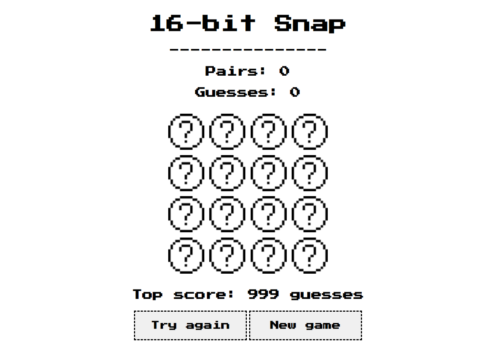

# 16-bit Snap!🍀

Having spent the past year developing a Puzzle Solving and Publishing website as part of a team using MongoDB, Express, React and Node 🧑‍💻 I thought it would be nice to take a step back from frameworks and databases, and make something *simple* ☺️  
Taking a look at my somewhat **limited** Github repository, I came across this 'snap'-style game and thought I could ✨ experiment ✨ with the styling and functionality, without breaking my previous commitment to simplicity. 

I chose to mess around with a retro-gaming 👾 16-bit-esque design, keeping with the traditional black and white 70s color theme. 

This is an **extremely** lightweight web application created entirely with native JavaScript, HTML, and CSS (unless you count the use of the Google Fonts API 😆), and while playable, probably won't be proving hours of entertainment for the whole family 😴 

In the future, I plan to add a welcome screen and hopefully improve the styling when I get the chance (or remember this project exists 😄), so keep an eye out!  

# How to run 🏃‍♂️
As with many other web applications, simply opening the HTML document in a modern browser should do the trick, provided the document has the expected paths to the supplementary images, styles, and scripts. 
